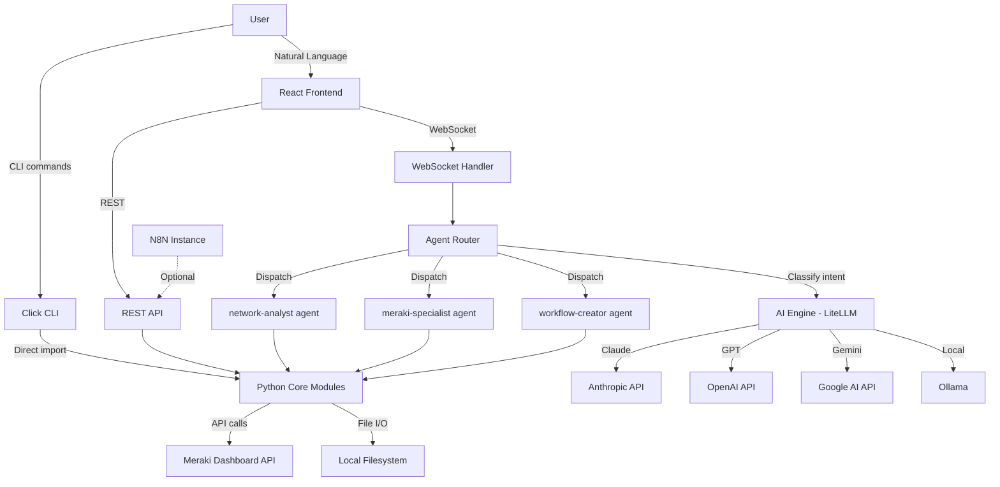

# Cisco Neural Language (CNL) - Brownfield Enhancement Architecture

> **Version:** 1.0.0
> **Type:** Brownfield Enhancement Architecture
> **Created:** 2026-02-05
> **Author:** Aria (Architect Agent) + jspetrucio
> **Status:** Draft
> **PRD:** [docs/prd.md](./prd.md)
> **Brief:** [docs/brief.md](./brief.md)

---

## 1. Introduction

This document defines the technical architecture for transforming the existing Meraki Workflow CLI tool into **Cisco Neural Language (CNL)** - a local-first desktop application with a chat interface, multi-provider AI engine, and multi-channel distribution.

The architecture is designed to **preserve the existing 10 Python modules unchanged** while adding new layers: a FastAPI server, WebSocket-based chat protocol, LLM-powered Agent Router, React frontend, and Tauri desktop wrapper.

### 1.1 Existing Project Analysis

| Attribute | Current State |
|-----------|---------------|
| **Primary Purpose** | CLI tool for automating Cisco Meraki network management |
| **Tech Stack** | Python 3.10+, Click, Rich, Jinja2, Pydantic, meraki SDK |
| **Architecture Style** | Modular monolith - 10 Python modules with clear separation of concerns |
| **Deployment** | Local pip install, developer runs via terminal |
| **Test Coverage** | pytest suite covering auth, api, discovery, config, changelog, templates |

**Existing Module Inventory (10 modules, ~10K LOC):**

| Module | LOC | Public API | Dependencies | Status |
|--------|-----|-----------|--------------|--------|
| `auth.py` | ~200 | 7 functions, 1 dataclass, 2 exceptions | dotenv, configparser, meraki | Production |
| `api.py` | ~400 | 1 class (30+ methods), 2 functions | meraki, auth | Production |
| `discovery.py` | ~500 | 4 dataclasses, 12 functions | api | Production |
| `config.py` | ~450 | 1 enum, 1 dataclass, 10 functions | api | Production |
| `workflow.py` | ~600 | 4 dataclasses, 2 enums, 1 builder, 10 functions | changelog | Production |
| `report.py` | ~400 | 2 dataclasses, 1 enum, 1 builder, 8 functions | discovery, jinja2 | Production |
| `changelog.py` | ~300 | 1 enum, 1 dataclass, 12 functions | subprocess (git) | Production |
| `cli.py` | ~500 | 7 command groups, 20+ commands | all modules, click, rich | Production |
| `report_server.py` | ~600 | 5 functions (standalone HTTP server) | http.server | Production |
| `template_loader.py` | ~400 | 1 class, 1 loader, 3 exceptions | json, re | Production |

**Architectural Patterns Already Established:**

1. **Singleton** - `get_client()` in api.py returns cached MerakiClient
2. **Builder** - WorkflowBuilder, ReportBuilder with fluent `.add_X().build()` API
3. **Factory** - `from_api()` class methods on dataclasses for deserialization
4. **Template (Clone+Patch)** - TemplateWorkflow clones with unique ID generation
5. **Repository** - File-based persistence (JSON snapshots, changelog.md, backups)
6. **Decorator** - `@log_api_call` for API call logging

**Internal Dependency Graph:**

```
auth.py (no deps)
  ↑
api.py
  ↑           ↑
discovery.py  config.py
  ↑
report.py

changelog.py (standalone, uses subprocess for git)
  ↑
workflow.py

template_loader.py (standalone)
report_server.py (standalone)

cli.py → ALL modules
```

### 1.2 Available Documentation

- [x] Project Brief (`docs/brief.md`)
- [x] Product Requirements Document (`docs/prd.md`)
- [x] Package configuration (`setup.py`, `requirements.txt`)
- [x] Agent definitions (`.claude/agents/*.md`)
- [x] Meraki API knowledge (`.claude/knowledge/`)
- [x] README and CLAUDE.md
- [ ] UX/UI Guidelines (new - to be created with frontend)

### 1.3 Change Log

| Change | Date | Version | Description | Author |
|--------|------|---------|-------------|--------|
| Initial Architecture | 2026-02-05 | 1.0.0 | Created from PRD and codebase analysis | Aria (Architect) |

---

## 2. Enhancement Scope and Integration Strategy

### 2.1 Enhancement Overview

| Attribute | Value |
|-----------|-------|
| **Enhancement Type** | New Feature Addition + Technology Stack Upgrade + UI/UX Overhaul |
| **Scope** | Add FastAPI server, React chat UI, Tauri desktop app, multi-provider AI, N8N integration, multi-channel distribution |
| **Integration Impact** | High - new layers added on top of existing modules, no modification to existing code |

### 2.2 Integration Approach

| Layer | Strategy |
|-------|----------|
| **Code Integration** | New modules (`server.py`, `agent_router.py`, `ai_engine.py`, `n8n_client.py`, `settings.py`) import and call existing modules directly. Zero modification to existing 10 modules. |
| **Data Integration** | Extend existing file-based persistence. New settings in `~/.cnl/settings.json`. Existing `~/.meraki/credentials` and `clients/` structure preserved. No database introduced. |
| **API Integration** | FastAPI exposes existing module functions as REST/WebSocket endpoints. Existing CLI remains unchanged alongside new `cnl` entry point. |
| **UI Integration** | Entirely new React frontend. No existing UI to integrate with. Chat renders existing HTML reports inline via iframe/sanitized HTML. |

### 2.3 Compatibility Requirements (from PRD)

| Requirement | Validation |
|-------------|-----------|
| **CR1: Python Core Modules** | All 10 modules called via import, never modified |
| **CR2: Credential Format** | `~/.meraki/credentials` INI format preserved; AI keys stored separately in `~/.cnl/settings.json` |
| **CR3: Client Directory Structure** | `clients/{name}/` structure unchanged; chat history added as `clients/{name}/chat/` |
| **CR4: CLI Interface** | Existing `meraki` CLI preserved; new `cnl` command is additive |
| **CR5: Workflow JSON Format** | SecureX/Cisco format unchanged |
| **CR6: Report Templates** | Jinja2 templates unchanged |

---

## 3. Tech Stack Alignment

### 3.1 Existing Technology Stack (Preserved)

| Category | Technology | Version | Role in Enhancement |
|----------|-----------|---------|---------------------|
| Language | Python | 3.10+ | Backend remains Python; new modules same language |
| API Client | meraki SDK | 1.53+ | Used by api.py, called through existing wrapper |
| CLI | Click | 8.0+ | Existing CLI preserved, `cnl` CLI added via Click |
| Terminal UI | Rich | 13.0+ | Used by CLI mode, not by web/desktop UI |
| Templates | Jinja2 | 3.1+ | Report generation unchanged |
| Validation | Pydantic | 2.0+ | Extended for new data models (settings, messages) |
| Config | python-dotenv | 1.0+ | Profile loading unchanged |
| PDF | WeasyPrint | 60.0+ | Optional PDF export unchanged |

### 3.2 New Technology Additions

| Technology | Version | Purpose | Rationale |
|-----------|---------|---------|-----------|
| **FastAPI** | 0.115+ | REST + WebSocket server | Best Python async web framework; native WebSocket support; auto-generates OpenAPI docs; Pydantic integration matches existing patterns |
| **uvicorn** | 0.30+ | ASGI server | Standard FastAPI production server; supports hot-reload for dev |
| **LiteLLM** | 1.50+ | Multi-provider AI abstraction | Single API for Claude/GPT/Gemini/Ollama; handles auth, streaming, fallbacks; 100+ provider support |
| **React** | 19+ | Chat UI framework | Industry standard; massive ecosystem; TypeScript support |
| **TypeScript** | 5.5+ | Frontend type safety | Catches errors at compile time; better IDE support |
| **Vite** | 6+ | Frontend build tool | Fast HMR; optimized production builds; React plugin |
| **shadcn/ui** | latest | UI component library | Copy-paste components (not dependency); Tailwind-based; accessible |
| **Tailwind CSS** | 4+ | Utility CSS | Already used in report_server.py templates; consistent design |
| **Zustand** | 5+ | State management | Lightweight (1KB); no boilerplate; works with React 19 |
| **Tauri** | 2.0+ | Desktop app wrapper | Small binary (~10MB); system WebView; Rust backend for sidecar |
| **N8N API** | latest | Workflow automation | REST API for workflow management; self-hosted compatible |

### 3.3 Decision Records

#### DR1: State Management - Zustand over Redux/Context

**Decision:** Use Zustand for frontend state management.

**Rationale:**
- CNL has simple state: chat messages, active agent, settings, connection status
- Zustand requires zero boilerplate (no reducers, actions, dispatch)
- 1KB bundle size vs Redux Toolkit's 11KB
- Works outside React components (useful for WebSocket handlers)
- No Provider wrapper needed

**Rejected:**
- Redux Toolkit: Over-engineered for this scope; CNL is not a complex SPA
- React Context: Re-renders entire tree on state change; no middleware support

#### DR2: Agent Router - LLM-based Classification with Rule Fallback

**Decision:** Use LLM function-calling for intent classification, with regex/keyword fallback when LLM is unavailable.

**Rationale:**
- LLM function-calling provides natural, flexible classification
- Users speak in natural language - rigid rules will miss edge cases
- Fallback rules handle obvious commands ("discover" → network-analyst)
- Confidence scoring allows "I'm not sure which agent, please clarify"

**Rejected:**
- Pure rule-based: Too brittle for natural language; requires maintaining regex patterns
- Separate classifier model: Unnecessary complexity; the main LLM can classify in-prompt

#### DR3: Tauri Sidecar Architecture

**Decision:** Tauri launches FastAPI as a sidecar process; frontend connects via localhost.

**Rationale:**
- Python cannot be compiled into Tauri's Rust binary
- Sidecar pattern is Tauri's official approach for non-Rust backends
- FastAPI runs on `localhost:3141` (port shared between Tauri and standalone web mode)
- Tauri WebView loads `http://localhost:3141` - same as browser mode
- Single codebase serves both desktop and web users

**Rejected:**
- Pywebview: No auto-update, no system tray, limited cross-platform
- Electron: 200MB+ binary, memory hog, overkill for wrapping localhost
- Wails (Go): Would require rewriting backend in Go

#### DR4: WebSocket Protocol over Server-Sent Events

**Decision:** Use WebSocket for real-time chat communication.

**Rationale:**
- Bidirectional: client sends messages, server streams responses
- FastAPI has native WebSocket support
- Supports structured JSON messages (not just text streams)
- Can push server-initiated events (discovery progress, agent status)

**Rejected:**
- SSE (Server-Sent Events): Unidirectional (server→client only); would need separate REST endpoint for sending messages
- HTTP Polling: High latency, wasteful

#### DR5: File-based Storage over SQLite

**Decision:** Continue file-based persistence for all data storage.

**Rationale:**
- Existing modules use JSON files and markdown - no migration needed
- CNL is a single-user local app - no concurrent access concerns
- Settings, chat history, snapshots all work well as files
- Simpler distribution (no database binary to bundle)
- Users can inspect/backup data as plain files

**Rejected:**
- SQLite: Adds dependency; requires migration tooling; overkill for single-user local app
- IndexedDB (frontend): Would split storage between Python and browser

---

## 4. System Architecture

### 4.1 High-Level Architecture

```
┌─────────────────────────────────────────────────────────────────┐
│                        USER INTERFACES                           │
│                                                                  │
│  ┌──────────┐   ┌──────────────┐   ┌────────────────────────┐  │
│  │   CLI    │   │  Web Browser │   │  Tauri Desktop App     │  │
│  │ (Click)  │   │ localhost:   │   │  (WebView → localhost) │  │
│  │          │   │   3141       │   │  + System Tray         │  │
│  └────┬─────┘   └──────┬──────┘   └───────────┬────────────┘  │
│       │                 │                       │                │
└───────┼─────────────────┼───────────────────────┼────────────────┘
        │                 │                       │
        │           ┌─────▼───────────────────────▼─────┐
        │           │         REACT FRONTEND             │
        │           │  ┌──────┐ ┌────────┐ ┌─────────┐  │
        │           │  │Chat  │ │Sidebar │ │Settings │  │
        │           │  │View  │ │(Agents)│ │Panel    │  │
        │           │  └──┬───┘ └────────┘ └─────────┘  │
        │           │     │  WebSocket + REST             │
        │           └─────┼──────────────────────────────┘
        │                 │
┌───────▼─────────────────▼──────────────────────────────────────┐
│                    FASTAPI SERVER (:3141)                        │
│                                                                  │
│  ┌──────────────────────────────────────────────────────────┐   │
│  │                    API LAYER                              │   │
│  │  ┌──────────┐  ┌──────────┐  ┌────────┐  ┌───────────┐  │   │
│  │  │WebSocket │  │REST API  │  │Static  │  │Health/    │  │   │
│  │  │/ws/chat  │  │/api/v1/* │  │Files   │  │Settings   │  │   │
│  │  └────┬─────┘  └────┬─────┘  └────────┘  └───────────┘  │   │
│  └───────┼──────────────┼────────────────────────────────────┘   │
│          │              │                                        │
│  ┌───────▼──────────────▼────────────────────────────────────┐   │
│  │                  AGENT ROUTER                              │   │
│  │  ┌────────────┐  ┌────────────┐  ┌──────────────────┐    │   │
│  │  │Intent      │  │Agent       │  │Response          │    │   │
│  │  │Classifier  │  │Dispatcher  │  │Formatter         │    │   │
│  │  │(LLM+Rules) │  │            │  │(Streaming)       │    │   │
│  │  └────────────┘  └─────┬──────┘  └──────────────────┘    │   │
│  └─────────────────────────┼─────────────────────────────────┘   │
│                            │                                     │
│  ┌─────────────────────────▼─────────────────────────────────┐   │
│  │                 AI ENGINE (LiteLLM)                         │   │
│  │  ┌──────────┐  ┌──────────┐  ┌──────────┐  ┌──────────┐  │   │
│  │  │Anthropic │  │OpenAI    │  │Google    │  │Ollama    │  │   │
│  │  │Claude    │  │GPT       │  │Gemini    │  │(local)   │  │   │
│  │  └──────────┘  └──────────┘  └──────────┘  └──────────┘  │   │
│  └────────────────────────────────────────────────────────────┘   │
│                                                                  │
│  ┌────────────────────────────────────────────────────────────┐   │
│  │              EXISTING PYTHON CORE (UNCHANGED)              │   │
│  │  ┌──────┐ ┌─────┐ ┌──────────┐ ┌────────┐ ┌──────────┐  │   │
│  │  │auth  │ │api  │ │discovery │ │config  │ │workflow  │  │   │
│  │  └──────┘ └─────┘ └──────────┘ └────────┘ └──────────┘  │   │
│  │  ┌──────┐ ┌─────────┐ ┌──────────────┐ ┌──────────┐    │   │
│  │  │report│ │changelog│ │template_loader│ │report_srv│    │   │
│  │  └──────┘ └─────────┘ └──────────────┘ └──────────┘    │   │
│  └────────────────────────────────────────────────────────────┘   │
│                            │                                     │
└────────────────────────────┼─────────────────────────────────────┘
                             │
                    ┌────────▼────────┐
                    │  Meraki API     │
                    │  (dashboard)    │
                    └─────────────────┘
```

### 4.2 Component Interaction Diagram



### 4.3 Request Flow

#### Chat Message Flow (WebSocket)

```
1. User types: "Show me all offline devices in the ACME network"
                           │
2. Frontend sends via WebSocket:
   { type: "message", content: "Show me all offline...", session_id: "abc" }
                           │
3. FastAPI WebSocket handler receives message
                           │
4. Agent Router classifies intent:
   a. Sends to LLM: "Classify this user request into one of:
      network-analyst, meraki-specialist, workflow-creator"
   b. LLM responds: { agent: "network-analyst", confidence: 0.95,
      action: "discovery", params: { filter: "offline" } }
                           │
5. Agent Router dispatches to network-analyst:
   a. Builds system prompt with agent persona + available functions
   b. Sends to LLM with function-calling enabled
   c. LLM generates function calls: discover_devices(), find_issues()
                           │
6. Agent executes function calls against existing modules:
   a. client = get_client("acme")
   b. result = full_discovery(client.org_id, client)
   c. offline = [d for d in result.devices if d.status == "offline"]
                           │
7. Agent Router formats response:
   a. LLM generates human-readable summary from raw data
   b. Includes structured data for UI rendering
                           │
8. FastAPI streams response via WebSocket:
   { type: "stream", chunk: "I found 3 offline devices..." }
   { type: "stream", chunk: "..in the ACME network:\n\n" }
   { type: "data", format: "device_table", data: [...] }
   { type: "done", agent: "network-analyst" }
                           │
9. Frontend renders: text as markdown, data as interactive table
```

#### Configuration Change Flow (Confirmation Required)

```
1. User: "Block telnet on all switches"
                           │
2. Agent Router → meraki-specialist (confidence: 0.98)
                           │
3. Agent plans changes:
   a. Discovers all switch networks
   b. Generates ACL rules: deny tcp any any port 23
   c. Creates backup plan
                           │
4. Server sends confirmation request:
   { type: "confirm", action: "add_switch_acl",
     preview: { networks: 5, rule: "deny tcp * * port 23" },
     message: "This will add a deny-telnet ACL to 5 networks. Proceed?" }
                           │
5. User confirms → Frontend sends: { type: "confirm", approved: true }
                           │
6. Agent executes with backup:
   a. backup_config(network_id, client_name, "acl") for each network
   b. add_switch_acl(network_id, "deny", "tcp", ...) for each network
   c. log_change(client_name, ChangeType.CONFIG_ACL, ...)
                           │
7. Server streams results:
   { type: "stream", chunk: "ACL applied to 5/5 networks." }
   { type: "data", format: "config_result", data: { success: 5, failed: 0 } }
   { type: "done" }
```

---

## 5. Component Architecture

### 5.1 FastAPI Server (`scripts/server.py`)

**Responsibility:** HTTP/WebSocket server that exposes existing modules as API endpoints and handles real-time chat.

**Key Design Decisions:**
- Single server process on `localhost:3141`
- Serves both REST API and static React frontend
- WebSocket endpoint for chat streaming
- CORS enabled for development (Vite dev server on :5173)

```python
# Server structure
app = FastAPI(title="CNL", version="1.0.0")

# Middleware
app.add_middleware(CORSMiddleware, ...)

# Static files (production - serves built React app)
app.mount("/", StaticFiles(directory="frontend/dist"), name="static")

# API routes
app.include_router(chat_router, prefix="/api/v1/chat")
app.include_router(discovery_router, prefix="/api/v1/discovery")
app.include_router(config_router, prefix="/api/v1/config")
app.include_router(workflow_router, prefix="/api/v1/workflows")
app.include_router(settings_router, prefix="/api/v1/settings")
app.include_router(profiles_router, prefix="/api/v1/profiles")
app.include_router(n8n_router, prefix="/api/v1/n8n")

# WebSocket
@app.websocket("/ws/chat")
async def chat_websocket(websocket: WebSocket): ...

# Health check
@app.get("/api/v1/health")
async def health(): ...
```

**Integration Points:**
- Imports from `scripts.auth`, `scripts.api`, `scripts.discovery`, etc.
- Uses `scripts.agent_router` for NL processing
- Uses `scripts.ai_engine` for LLM calls
- Uses `scripts.settings` for user configuration

**Dependencies:**
- Existing: all `scripts.*` modules
- New: `fastapi`, `uvicorn`, `websockets`

### 5.2 Agent Router (`scripts/agent_router.py`)

**Responsibility:** Classify user intent, select appropriate agent, execute agent workflow, format response.

**Architecture:**

```python
# Agent definitions
AGENTS = {
    "network-analyst": AgentDefinition(
        name="network-analyst",
        description="Network discovery, analysis, diagnostics",
        functions=[
            "full_discovery", "discover_networks", "discover_devices",
            "discover_ssids", "find_issues", "generate_suggestions",
            "compare_snapshots", "save_snapshot"
        ],
        system_prompt="...",  # Loaded from .claude/agents/network-analyst.md
    ),
    "meraki-specialist": AgentDefinition(
        name="meraki-specialist",
        description="Configure ACL, Firewall, SSID, VLAN, Switch, Camera",
        functions=[
            "configure_ssid", "enable_ssid", "disable_ssid",
            "add_firewall_rule", "remove_firewall_rule",
            "add_switch_acl", "create_vlan", "update_vlan",
            "backup_config", "rollback_config"
        ],
        system_prompt="...",
    ),
    "workflow-creator": AgentDefinition(
        name="workflow-creator",
        description="Create automation workflows in Cisco/SecureX format",
        functions=[
            "create_device_offline_handler", "create_firmware_compliance_check",
            "create_scheduled_report", "create_security_alert_handler",
            "create_workflow_from_template", "list_workflows"
        ],
        system_prompt="...",
    ),
}

# Classification pipeline
class AgentRouter:
    def __init__(self, ai_engine: AIEngine):
        self.ai_engine = ai_engine
        self.agents = AGENTS

    async def classify_intent(self, message: str) -> ClassificationResult:
        """Classify user message to determine target agent."""
        # Step 1: Fast regex/keyword check
        quick_match = self._quick_classify(message)
        if quick_match and quick_match.confidence > 0.9:
            return quick_match

        # Step 2: LLM-based classification via function calling
        return await self._llm_classify(message)

    async def process_message(self, message: str, session: ChatSession) -> AsyncGenerator[ChatChunk, None]:
        """Full pipeline: classify → dispatch → execute → format → stream."""
        classification = await self.classify_intent(message)
        agent = self.agents[classification.agent_name]

        async for chunk in self._execute_agent(agent, message, session):
            yield chunk

    def _quick_classify(self, message: str) -> Optional[ClassificationResult]:
        """Rule-based fallback for obvious commands."""
        patterns = {
            "network-analyst": r"discover|scan|analyz|diagnos|health|status|offline|inventory",
            "meraki-specialist": r"config|ssid|vlan|firewall|acl|switch|port|camera|block|allow|deny",
            "workflow-creator": r"workflow|automat|schedule|alert|notif|trigger|template",
        }
        # ... match against patterns, return with confidence score
```

**Function Registry:**

The Agent Router maintains a registry that maps function names to actual Python callables from existing modules:

```python
FUNCTION_REGISTRY = {
    # discovery.py
    "full_discovery": scripts.discovery.full_discovery,
    "discover_networks": scripts.discovery.discover_networks,
    "find_issues": scripts.discovery.find_issues,
    "save_snapshot": scripts.discovery.save_snapshot,
    "compare_snapshots": scripts.discovery.compare_snapshots,

    # config.py
    "configure_ssid": scripts.config.configure_ssid,
    "add_firewall_rule": scripts.config.add_firewall_rule,
    "add_switch_acl": scripts.config.add_switch_acl,
    "backup_config": scripts.config.backup_config,
    "rollback_config": scripts.config.rollback_config,

    # workflow.py
    "create_device_offline_handler": scripts.workflow.create_device_offline_handler,
    "save_workflow": scripts.workflow.save_workflow,

    # report.py
    "generate_discovery_report": scripts.report.generate_discovery_report,

    # ... etc
}
```

The LLM receives these as tool/function definitions and can call them. The router executes the actual Python function and returns results.

### 5.3 AI Engine (`scripts/ai_engine.py`)

**Responsibility:** Unified interface for all LLM providers via LiteLLM.

```python
class AIEngine:
    def __init__(self, settings: Settings):
        self.provider = settings.ai_provider  # "anthropic", "openai", "google", "ollama"
        self.model = settings.ai_model        # "claude-sonnet-4-5-20250929", "gpt-4o", etc.
        self.api_key = settings.ai_api_key

    async def chat_completion(
        self,
        messages: list[dict],
        tools: Optional[list[dict]] = None,
        stream: bool = True,
        temperature: float = 0.1,
    ) -> AsyncGenerator[str, None]:
        """Stream chat completion from configured provider."""
        response = await litellm.acompletion(
            model=self._get_model_string(),
            messages=messages,
            tools=tools,
            stream=stream,
            temperature=temperature,
            api_key=self.api_key,
        )
        async for chunk in response:
            yield chunk

    async def classify(
        self,
        message: str,
        agents: dict[str, AgentDefinition],
    ) -> ClassificationResult:
        """Use function-calling to classify intent."""
        tools = [{
            "type": "function",
            "function": {
                "name": "route_to_agent",
                "description": "Route the user's message to the appropriate agent",
                "parameters": {
                    "type": "object",
                    "properties": {
                        "agent": {
                            "type": "string",
                            "enum": list(agents.keys()),
                            "description": "The agent to handle this request"
                        },
                        "confidence": {
                            "type": "number",
                            "description": "Confidence score 0.0-1.0"
                        },
                        "reasoning": {
                            "type": "string",
                            "description": "Why this agent was chosen"
                        }
                    },
                    "required": ["agent", "confidence"]
                }
            }
        }]
        # ... execute and parse response

    def _get_model_string(self) -> str:
        """LiteLLM model string format."""
        model_map = {
            ("anthropic", "claude-sonnet"): "anthropic/claude-sonnet-4-5-20250929",
            ("anthropic", "claude-haiku"): "anthropic/claude-haiku-4-5-20251001",
            ("openai", "gpt-4o"): "openai/gpt-4o",
            ("openai", "gpt-4o-mini"): "openai/gpt-4o-mini",
            ("google", "gemini-pro"): "gemini/gemini-2.0-flash",
            ("ollama", "llama3"): "ollama/llama3.2",
        }
        return model_map.get((self.provider, self.model), self.model)
```

**Provider Configuration:**

| Provider | Auth | Streaming | Function Calling | Local |
|----------|------|-----------|------------------|-------|
| Anthropic (Claude) | API key | Yes | Yes (tools) | No |
| OpenAI (GPT) | API key | Yes | Yes (tools) | No |
| Google (Gemini) | API key | Yes | Yes (tools) | No |
| Ollama | None | Yes | Limited | Yes |

### 5.4 Settings Manager (`scripts/settings.py`)

**Responsibility:** Manage all user settings, stored in `~/.cnl/settings.json`.

```python
@dataclass
class Settings:
    # AI Provider
    ai_provider: str = "anthropic"          # anthropic, openai, google, ollama
    ai_model: str = "claude-sonnet"         # Provider-specific model
    ai_api_key: Optional[str] = None        # Encrypted at rest

    # Meraki
    meraki_profile: str = "default"         # Active profile name

    # N8N (optional)
    n8n_enabled: bool = False
    n8n_url: Optional[str] = None           # http://localhost:5678
    n8n_api_key: Optional[str] = None

    # UI
    theme: str = "dark"                     # dark, light
    language: str = "en"                    # en, pt

    # Server
    port: int = 3141

    # Privacy
    telemetry_enabled: bool = False         # Always false for internal tool

class SettingsManager:
    CONFIG_DIR = Path.home() / ".cnl"
    SETTINGS_FILE = CONFIG_DIR / "settings.json"

    def load(self) -> Settings: ...
    def save(self, settings: Settings) -> None: ...
    def update(self, **kwargs) -> Settings: ...
    def is_onboarding_complete(self) -> bool: ...
    def encrypt_key(self, key: str) -> str: ...
    def decrypt_key(self, encrypted: str) -> str: ...
```

**Encryption:** API keys encrypted using `cryptography.Fernet` with a machine-derived key (hostname + username hash). Not military-grade - prevents casual file reading.

### 5.5 N8N Client (`scripts/n8n_client.py`)

**Responsibility:** Optional integration with user's N8N instance for workflow automation.

```python
class N8NClient:
    def __init__(self, base_url: str, api_key: str):
        self.base_url = base_url.rstrip("/")
        self.api_key = api_key
        self.headers = {"X-N8N-API-KEY": api_key}

    async def test_connection(self) -> bool: ...
    async def list_workflows(self) -> list[dict]: ...
    async def create_workflow(self, workflow_data: dict) -> dict: ...
    async def activate_workflow(self, workflow_id: str) -> dict: ...
    async def deactivate_workflow(self, workflow_id: str) -> dict: ...
    async def get_executions(self, workflow_id: str, limit: int = 10) -> list[dict]: ...
```

**Pre-built N8N Templates:**
- Scheduled discovery (daily/weekly network scan)
- Firmware compliance check
- Device offline alert (webhook → Slack/email)
- Configuration drift detection

### 5.6 React Frontend (`frontend/`)

**Responsibility:** Chat-based UI for interacting with CNL agents.

**Component Architecture:**

```
frontend/src/
├── App.tsx                    # Root: Router, WebSocket provider
├── main.tsx                   # Entry point
│
├── components/
│   ├── chat/
│   │   ├── ChatView.tsx       # Main chat area with messages
│   │   ├── MessageBubble.tsx  # Individual message (user/agent)
│   │   ├── ChatInput.tsx      # Text input with send button
│   │   ├── StreamingText.tsx  # Animated text streaming
│   │   ├── ConfirmDialog.tsx  # Configuration change confirmation
│   │   └── DataRenderer.tsx   # Tables, charts, reports inline
│   │
│   ├── sidebar/
│   │   ├── AgentSidebar.tsx   # Agent list with descriptions
│   │   ├── AgentCard.tsx      # Individual agent status
│   │   └── ProfileSwitcher.tsx # Meraki profile switching
│   │
│   ├── onboarding/
│   │   ├── OnboardingWizard.tsx   # 3-step setup wizard
│   │   ├── MerakiKeyStep.tsx      # Step 1: Meraki API key
│   │   ├── OrgSelectStep.tsx      # Step 2: Organization selection
│   │   └── AIProviderStep.tsx     # Step 3: AI provider + key
│   │
│   ├── settings/
│   │   ├── SettingsPanel.tsx      # Settings page
│   │   ├── AIProviderSettings.tsx # AI provider configuration
│   │   ├── ProfileManager.tsx     # Meraki profiles CRUD
│   │   └── N8NSettings.tsx        # N8N connection settings
│   │
│   └── common/
│       ├── Header.tsx         # App header with status
│       ├── StatusBadge.tsx    # Connection status indicator
│       └── ThemeToggle.tsx    # Dark/light mode toggle
│
├── hooks/
│   ├── useWebSocket.ts        # WebSocket connection management
│   ├── useChat.ts             # Chat message management
│   ├── useSettings.ts         # Settings API calls
│   └── useProfiles.ts         # Profile management
│
├── stores/
│   ├── chatStore.ts           # Zustand: messages, sessions
│   ├── agentStore.ts          # Zustand: active agent, status
│   ├── settingsStore.ts       # Zustand: user settings cache
│   └── connectionStore.ts     # Zustand: WebSocket/server status
│
├── lib/
│   ├── api.ts                 # REST API client (fetch wrapper)
│   ├── ws.ts                  # WebSocket client with reconnect
│   └── types.ts               # TypeScript interfaces
│
└── styles/
    └── globals.css            # Tailwind imports + custom styles
```

**Key Frontend Patterns:**

1. **WebSocket with Auto-Reconnect:**
```typescript
// hooks/useWebSocket.ts
const useWebSocket = () => {
  const ws = useRef<WebSocket | null>(null);
  const reconnectTimer = useRef<number>();

  const connect = () => {
    ws.current = new WebSocket(`ws://localhost:${port}/ws/chat`);
    ws.current.onmessage = (event) => {
      const data = JSON.parse(event.data);
      switch (data.type) {
        case "stream": handleStream(data); break;
        case "data": handleData(data); break;
        case "confirm": handleConfirm(data); break;
        case "done": handleDone(data); break;
        case "error": handleError(data); break;
      }
    };
    ws.current.onclose = () => {
      reconnectTimer.current = setTimeout(connect, 3000);
    };
  };
};
```

2. **Zustand Store (Chat):**
```typescript
// stores/chatStore.ts
interface ChatStore {
  messages: Message[];
  activeSession: string;
  isStreaming: boolean;
  addMessage: (msg: Message) => void;
  appendToLast: (chunk: string) => void;
  setStreaming: (v: boolean) => void;
}

const useChatStore = create<ChatStore>((set) => ({
  messages: [],
  activeSession: generateSessionId(),
  isStreaming: false,
  addMessage: (msg) => set((s) => ({ messages: [...s.messages, msg] })),
  appendToLast: (chunk) => set((s) => ({
    messages: s.messages.map((m, i) =>
      i === s.messages.length - 1 ? { ...m, content: m.content + chunk } : m
    ),
  })),
  setStreaming: (v) => set({ isStreaming: v }),
}));
```

### 5.7 Tauri Desktop App (`src-tauri/`)

**Responsibility:** Native desktop wrapper that bundles FastAPI backend + React frontend.

**Sidecar Architecture:**

```
┌─────────────────────────────────────────┐
│           Tauri Application              │
│                                          │
│  ┌──────────────────────────────────┐   │
│  │         Rust Backend              │   │
│  │  ┌──────────┐ ┌───────────────┐  │   │
│  │  │Sidecar   │ │System Tray    │  │   │
│  │  │Manager   │ │Manager        │  │   │
│  │  │(spawns   │ │(status, quit, │  │   │
│  │  │ uvicorn) │ │ open window)  │  │   │
│  │  └────┬─────┘ └───────────────┘  │   │
│  └───────┼──────────────────────────┘   │
│          │                               │
│  ┌───────▼──────────────────────────┐   │
│  │      FastAPI Process              │   │
│  │      (localhost:3141)             │   │
│  │      Python + uvicorn             │   │
│  └───────▲──────────────────────────┘   │
│          │                               │
│  ┌───────┼──────────────────────────┐   │
│  │      WebView                      │   │
│  │      (loads localhost:3141)       │   │
│  │      System WebView (not Chromium)│   │
│  └──────────────────────────────────┘   │
│                                          │
└─────────────────────────────────────────┘
```

**Rust Sidecar Manager:**

```rust
// src-tauri/src/main.rs
use tauri::Manager;
use std::process::{Command, Child};

struct ServerState {
    process: Option<Child>,
}

fn start_server() -> Child {
    // Find bundled Python or system Python
    let python = find_python();

    Command::new(python)
        .args(["-m", "uvicorn", "scripts.server:app",
               "--host", "127.0.0.1", "--port", "3141"])
        .spawn()
        .expect("Failed to start CNL server")
}

fn main() {
    tauri::Builder::default()
        .setup(|app| {
            // Start FastAPI sidecar
            let server = start_server();
            app.manage(ServerState { process: Some(server) });

            // Wait for server to be ready
            wait_for_health("http://127.0.0.1:3141/api/v1/health");

            Ok(())
        })
        .system_tray(create_system_tray())
        .on_system_tray_event(handle_tray_event)
        .on_window_event(|event| {
            // Minimize to tray on close
            if let tauri::WindowEvent::CloseRequested { api, .. } = event.event() {
                event.window().hide().unwrap();
                api.prevent_close();
            }
        })
        .run(tauri::generate_context!())
        .expect("error running CNL");
}
```

**Tauri Configuration (`tauri.conf.json`):**

```json
{
  "build": {
    "devUrl": "http://localhost:5173",
    "frontendDist": "../frontend/dist"
  },
  "app": {
    "windows": [{
      "title": "Cisco Neural Language",
      "width": 1200,
      "height": 800,
      "minWidth": 800,
      "minHeight": 600,
      "decorations": true,
      "resizable": true
    }],
    "trayIcon": {
      "iconPath": "icons/tray-icon.png",
      "tooltip": "CNL - Cisco Neural Language"
    }
  },
  "bundle": {
    "identifier": "com.cisco.cnl",
    "active": true,
    "targets": ["dmg", "app"],
    "externalBin": ["python-sidecar"],
    "resources": ["scripts/**", "templates/**"]
  }
}
```

---

## 6. API Design

### 6.1 REST API Endpoints

**Base URL:** `http://localhost:3141/api/v1`

#### Health & Status

| Method | Path | Purpose |
|--------|------|---------|
| GET | `/health` | Server health check |
| GET | `/status` | Connection status (Meraki, AI, N8N) |

#### Settings & Onboarding

| Method | Path | Purpose |
|--------|------|---------|
| GET | `/settings` | Get current settings |
| PATCH | `/settings` | Update settings |
| POST | `/settings/validate-meraki` | Validate Meraki API key |
| POST | `/settings/validate-ai` | Validate AI provider key |
| GET | `/settings/onboarding-status` | Check if onboarding complete |

#### Profiles

| Method | Path | Purpose |
|--------|------|---------|
| GET | `/profiles` | List Meraki profiles |
| POST | `/profiles` | Create new profile |
| GET | `/profiles/{name}` | Get profile details |
| DELETE | `/profiles/{name}` | Delete profile |
| POST | `/profiles/{name}/activate` | Set as active profile |

#### Discovery

| Method | Path | Purpose |
|--------|------|---------|
| POST | `/discovery/full` | Run full discovery |
| GET | `/discovery/snapshots` | List snapshots |
| GET | `/discovery/snapshots/{id}` | Get snapshot data |
| POST | `/discovery/compare` | Compare two snapshots |

#### Configuration

| Method | Path | Purpose |
|--------|------|---------|
| GET | `/config/networks` | List networks |
| GET | `/config/networks/{id}/ssids` | Get SSIDs |
| POST | `/config/ssid` | Configure SSID |
| POST | `/config/firewall` | Add firewall rule |
| POST | `/config/acl` | Add switch ACL |
| POST | `/config/vlan` | Create/update VLAN |
| POST | `/config/rollback` | Rollback configuration |

#### Workflows

| Method | Path | Purpose |
|--------|------|---------|
| GET | `/workflows` | List workflows |
| POST | `/workflows` | Create workflow |
| GET | `/workflows/templates` | List templates |
| POST | `/workflows/from-template` | Create from template |

#### N8N (Optional)

| Method | Path | Purpose |
|--------|------|---------|
| POST | `/n8n/test-connection` | Test N8N connectivity |
| GET | `/n8n/workflows` | List N8N workflows |
| POST | `/n8n/workflows` | Push workflow to N8N |
| GET | `/n8n/executions` | Get execution history |

### 6.2 WebSocket Protocol

**Endpoint:** `ws://localhost:3141/ws/chat`

#### Client → Server Messages

```typescript
// User message
{ type: "message", content: string, session_id: string }

// Confirmation response
{ type: "confirm_response", request_id: string, approved: boolean }

// Cancel streaming
{ type: "cancel" }

// Ping (keepalive)
{ type: "ping" }
```

#### Server → Client Messages

```typescript
// Text streaming chunk
{ type: "stream", chunk: string, agent: string }

// Structured data (tables, charts, reports)
{ type: "data", format: string, data: any, agent: string }

// Confirmation request (before config changes)
{ type: "confirm", request_id: string, action: string, preview: any, message: string }

// Agent status change
{ type: "agent_status", agent: string, status: "thinking" | "executing" | "done" }

// Error
{ type: "error", message: string, code: string }

// Stream complete
{ type: "done", agent: string, session_id: string }

// Pong
{ type: "pong" }
```

### 6.3 External API Integration

#### Meraki Dashboard API (Existing)

- **Purpose:** Network management operations
- **Documentation:** https://developer.cisco.com/meraki/api-v1/
- **Base URL:** `https://api.meraki.com/api/v1/`
- **Authentication:** API key in `X-Cisco-Meraki-API-Key` header
- **Integration:** Via existing `api.py` → `meraki` SDK (no changes)
- **Rate Limit:** 10 req/s per organization (SDK manages)
- **Error Handling:** Existing `safe_call()` pattern preserved

#### LLM Provider APIs (New, via LiteLLM)

| Provider | Base URL | Auth | Model Examples |
|----------|----------|------|----------------|
| Anthropic | `https://api.anthropic.com/v1` | `x-api-key` header | claude-sonnet-4-5-20250929, claude-haiku-4-5-20251001 |
| OpenAI | `https://api.openai.com/v1` | `Authorization: Bearer` | gpt-4o, gpt-4o-mini |
| Google | `https://generativelanguage.googleapis.com` | API key param | gemini-2.0-flash |
| Ollama | `http://localhost:11434` | None (local) | llama3.2, mistral |

All provider communication is handled by LiteLLM - CNL never makes direct API calls to providers.

#### N8N API (New, Optional)

- **Purpose:** Workflow automation
- **Documentation:** https://docs.n8n.io/api/
- **Base URL:** User-configured (typically `http://localhost:5678`)
- **Authentication:** `X-N8N-API-KEY` header
- **Error Handling:** Graceful degradation - CNL works without N8N

---

## 7. Data Models

### 7.1 New Data Models

#### ChatMessage

```python
@dataclass
class ChatMessage:
    id: str                          # UUID
    session_id: str                  # Chat session identifier
    role: str                        # "user" | "assistant" | "system"
    content: str                     # Message text (markdown)
    agent: Optional[str] = None      # Which agent responded
    data: Optional[dict] = None      # Structured data (tables, etc.)
    timestamp: datetime = field(default_factory=datetime.now)

    def to_dict(self) -> dict: ...

    @classmethod
    def from_dict(cls, data: dict) -> "ChatMessage": ...
```

#### ChatSession

```python
@dataclass
class ChatSession:
    id: str                          # Session UUID
    profile: str                     # Active Meraki profile
    messages: list[ChatMessage]      # Chat history
    created_at: datetime
    last_active: datetime

    def save(self, client_name: str) -> Path:
        """Save to clients/{name}/chat/{session_id}.json"""

    @classmethod
    def load(cls, path: Path) -> "ChatSession": ...
```

#### AgentDefinition

```python
@dataclass
class AgentDefinition:
    name: str                        # "network-analyst"
    description: str                 # Agent capabilities summary
    system_prompt: str               # Full agent persona prompt
    functions: list[str]             # Available function names
    icon: str                        # Emoji or icon identifier
    examples: list[str]              # Example user queries
```

#### ClassificationResult

```python
@dataclass
class ClassificationResult:
    agent_name: str                  # Selected agent
    confidence: float                # 0.0 - 1.0
    reasoning: str                   # Why this agent
    requires_confirmation: bool      # If action modifies config
```

### 7.2 Persistence Strategy

| Data | Format | Location | Retention |
|------|--------|----------|-----------|
| User settings | JSON | `~/.cnl/settings.json` | Permanent |
| AI API keys | Encrypted JSON | `~/.cnl/settings.json` | Permanent |
| Meraki credentials | INI | `~/.meraki/credentials` | Permanent (existing) |
| Chat history | JSON per session | `clients/{name}/chat/` | Permanent |
| Discovery snapshots | JSON | `clients/{name}/discovery/` | Permanent (existing) |
| Config backups | JSON | `clients/{name}/backups/` | Permanent (existing) |
| Workflows | JSON | `clients/{name}/workflows/` | Permanent (existing) |
| Reports | HTML/PDF | `clients/{name}/reports/` | Permanent (existing) |
| Changelog | Markdown | `clients/{name}/changelog.md` | Permanent (existing) |
| Server logs | Text | `~/.cnl/logs/` | 30 days rotation |

No database. No migrations. All data is human-readable files.

---

## 8. Source Tree Integration

### 8.1 Existing Structure (Relevant Parts)

```
Meraki_Workflow/
├── scripts/              # Python core modules (10 files)
│   ├── __init__.py
│   ├── auth.py
│   ├── api.py
│   ├── discovery.py
│   ├── config.py
│   ├── workflow.py
│   ├── report.py
│   ├── changelog.py
│   ├── cli.py
│   ├── report_server.py
│   └── template_loader.py
├── templates/            # Workflow templates
│   └── workflows/
├── clients/              # Per-client data
├── tests/                # Existing tests
├── docs/                 # Documentation
├── setup.py
└── requirements.txt
```

### 8.2 New Additions

```
Meraki_Workflow/
├── scripts/                      # [EXISTING] Python core
│   ├── __init__.py               # [UPDATE] Add new module exports
│   ├── auth.py                   # [KEEP]
│   ├── api.py                    # [KEEP]
│   ├── discovery.py              # [KEEP]
│   ├── config.py                 # [KEEP]
│   ├── workflow.py               # [KEEP]
│   ├── report.py                 # [KEEP]
│   ├── changelog.py              # [KEEP]
│   ├── cli.py                    # [KEEP]
│   ├── report_server.py          # [KEEP]
│   ├── template_loader.py        # [KEEP]
│   ├── server.py                 # [NEW] FastAPI + WebSocket server
│   ├── agent_router.py           # [NEW] Intent classification + dispatch
│   ├── ai_engine.py              # [NEW] LiteLLM multi-provider
│   ├── settings.py               # [NEW] Settings management
│   └── n8n_client.py             # [NEW] N8N API client
│
├── frontend/                     # [NEW] React chat UI
│   ├── src/
│   │   ├── components/
│   │   │   ├── chat/             # Chat UI components
│   │   │   ├── sidebar/          # Agent sidebar
│   │   │   ├── onboarding/       # Setup wizard
│   │   │   ├── settings/         # Settings panel
│   │   │   └── common/           # Shared components
│   │   ├── hooks/                # Custom React hooks
│   │   ├── stores/               # Zustand state stores
│   │   ├── lib/                  # API/WS clients, types
│   │   ├── App.tsx
│   │   └── main.tsx
│   ├── index.html
│   ├── package.json
│   ├── tsconfig.json
│   ├── vite.config.ts
│   └── tailwind.config.ts
│
├── src-tauri/                    # [NEW] Tauri desktop app
│   ├── src/
│   │   └── main.rs              # Sidecar manager, system tray
│   ├── icons/                   # App icons (all sizes)
│   ├── tauri.conf.json
│   └── Cargo.toml
│
├── docker/                       # [NEW] Docker distribution
│   ├── Dockerfile
│   └── docker-compose.yml
│
├── dist/                         # [NEW] npm distribution
│   ├── bin/
│   │   └── cnl.js               # npx entry point
│   └── package.json             # npm package config
│
├── homebrew/                     # [NEW] Homebrew formula
│   └── cnl.rb                   # Formula definition
│
├── templates/                    # [EXISTING]
│   └── workflows/
├── clients/                      # [EXISTING]
│   └── {name}/
│       └── chat/                # [NEW] Chat history per client
├── tests/                        # [EXISTING + NEW]
│   ├── test_auth.py             # [EXISTING]
│   ├── test_api.py              # [EXISTING]
│   ├── test_server.py           # [NEW] FastAPI endpoint tests
│   ├── test_agent_router.py     # [NEW] Router + classification tests
│   ├── test_ai_engine.py        # [NEW] LiteLLM integration tests
│   └── test_settings.py         # [NEW] Settings management tests
├── docs/
│   ├── brief.md                 # [EXISTING]
│   ├── prd.md                   # [EXISTING]
│   └── architecture.md          # [NEW - THIS FILE]
│
├── setup.py                     # [UPDATE] Add new deps
├── pyproject.toml               # [NEW] Modern Python packaging
├── requirements.txt             # [UPDATE] Add FastAPI, LiteLLM, etc.
├── package.json                 # [NEW] Frontend + npm distribution
└── README.md                    # [UPDATE] Product docs
```

### 8.3 Integration Guidelines

| Aspect | Rule |
|--------|------|
| **File Naming** | Python: `snake_case.py`. TypeScript: `PascalCase.tsx` (components), `camelCase.ts` (hooks/utils). Follow existing conventions. |
| **Folder Organization** | New Python modules in `scripts/`. Frontend in `frontend/`. Tauri in `src-tauri/`. Distribution configs at root. |
| **Import Patterns** | New modules import from existing: `from scripts.discovery import full_discovery`. Never patch or monkey-patch existing modules. |
| **Test Location** | New tests alongside existing in `tests/`. Follow `test_{module}.py` convention. |

---

## 9. Infrastructure and Deployment

### 9.1 Local-Only Architecture

CNL is a **local-first application**. There is no cloud infrastructure, no remote servers, no hosted database. Everything runs on the user's machine.

```
User's Machine
├── CNL Application (Tauri .app or python process)
│   ├── FastAPI server (localhost:3141)
│   ├── React frontend (served by FastAPI)
│   └── Python modules (scripts/*)
│
├── Data Storage
│   ├── ~/.cnl/settings.json (app settings)
│   ├── ~/.cnl/logs/ (server logs)
│   ├── ~/.meraki/credentials (Meraki API keys)
│   └── clients/ (per-client data)
│
├── External Connections (outbound only)
│   ├── Meraki API (api.meraki.com)
│   ├── AI Provider (api.anthropic.com / api.openai.com / etc.)
│   └── N8N (localhost:5678, optional)
│
└── Optional: Ollama (localhost:11434, for local AI)
```

### 9.2 Distribution Channels

| Channel | Technology | Target Users | Binary Size |
|---------|-----------|--------------|-------------|
| **Tauri .app/.dmg** | Tauri 2.0 + bundled Python | Desktop users (primary) | ~30MB |
| **pip** | `pip install cnl` | Python developers | ~5MB |
| **npm/npx** | `npx cnl` → spawns Python | Node.js developers | ~2MB (wrapper) |
| **Homebrew** | `brew install cnl` | macOS power users | ~5MB |
| **Docker** | `docker run cnl` | Container users | ~200MB |

### 9.3 Build Pipeline

```
Source Code
     │
     ├──► Frontend Build (Vite)
     │    └── frontend/dist/ (static files)
     │
     ├──► Python Package (setuptools/poetry)
     │    └── dist/cnl-1.0.0.tar.gz
     │
     ├──► Tauri Build (includes frontend + Python)
     │    ├── target/release/bundle/dmg/CNL.dmg (macOS)
     │    ├── target/release/bundle/msi/CNL.msi (Windows)
     │    └── target/release/bundle/appimage/CNL.AppImage (Linux)
     │
     ├──► Docker Build
     │    └── cnl:latest image
     │
     └──► npm Package
          └── cnl-1.0.0.tgz
```

### 9.4 GitHub Actions CI/CD

```yaml
# .github/workflows/release.yml
name: Release
on:
  push:
    tags: ["v*"]

jobs:
  # 1. Test
  test:
    runs-on: ubuntu-latest
    steps:
      - uses: actions/setup-python@v5
      - run: pip install -e ".[dev]"
      - run: pytest tests/

  # 2. Build Frontend
  build-frontend:
    runs-on: ubuntu-latest
    steps:
      - run: cd frontend && npm ci && npm run build

  # 3. Build Tauri (matrix: mac, windows, linux)
  build-tauri:
    needs: [test, build-frontend]
    strategy:
      matrix:
        platform: [macos-latest, windows-latest, ubuntu-latest]
    steps:
      - uses: tauri-apps/tauri-action@v0

  # 4. Publish
  publish:
    needs: build-tauri
    steps:
      - run: pip publish  # PyPI
      - run: npm publish  # npm
      - run: docker build && docker push  # Docker Hub
      # Homebrew formula updated via PR to tap repo
```

### 9.5 Rollback Strategy

| Scenario | Rollback Method |
|----------|----------------|
| Bad Tauri release | Tauri auto-updater supports rollback; user reinstalls previous .dmg |
| Bad pip release | `pip install cnl==previous_version` |
| Config change error | Existing `rollback_config()` in config.py (backup-based) |
| Corrupted settings | Delete `~/.cnl/settings.json` → re-run onboarding |

---

## 10. Coding Standards and Conventions

### 10.1 Existing Standards (Python)

| Standard | Convention |
|----------|-----------|
| **Code Style** | PEP 8 via ruff linter |
| **Type Hints** | Used on all function signatures (Python 3.10+ syntax) |
| **Data Models** | `@dataclass` for data containers, Pydantic for validation |
| **Naming** | `snake_case` functions/variables, `PascalCase` classes |
| **Imports** | Relative imports within `scripts` package (`from .auth import`) |
| **Error Handling** | Custom exception classes per module; `safe_call()` for API operations |
| **Logging** | Python `logging` module; `@log_api_call` decorator pattern |
| **Documentation** | Docstrings on all public functions (not excessive) |

### 10.2 New Standards (Frontend)

| Standard | Convention |
|----------|-----------|
| **Code Style** | Prettier + ESLint with TypeScript strict mode |
| **Components** | Functional components with hooks (no class components) |
| **State** | Zustand stores in `stores/`, component-local state with `useState` |
| **Styling** | Tailwind utility classes; shadcn/ui for complex components |
| **Naming** | `PascalCase.tsx` components, `camelCase.ts` utilities/hooks |
| **Types** | TypeScript strict mode; interfaces for all API responses |
| **Error Handling** | Error boundaries for UI; try/catch for async operations |

### 10.3 Critical Integration Rules

| Rule | Description |
|------|-------------|
| **No existing module modification** | New code imports existing modules. Never modify auth.py, api.py, discovery.py, config.py, workflow.py, report.py, changelog.py, cli.py, report_server.py, or template_loader.py. |
| **Consistent error propagation** | New modules raise typed exceptions (like existing `CredentialsNotFoundError`). FastAPI catches and returns structured error responses. |
| **Async boundary** | FastAPI endpoints are async. Existing modules are sync. Use `asyncio.to_thread()` to call sync functions from async endpoints. |
| **Logging consistency** | New modules use same `logging` module pattern. Log levels: DEBUG (function calls), INFO (operations), WARNING (degraded), ERROR (failures). |

---

## 11. Testing Strategy

### 11.1 Existing Test Suite

| Area | Framework | Location | Status |
|------|-----------|----------|--------|
| Auth | pytest | `tests/test_auth.py` | Passing |
| API | pytest + mocks | `tests/test_api.py` | Passing |
| Discovery | pytest + mocks | `tests/test_discovery.py` | Passing |
| Config | pytest + mocks | `tests/test_config.py` | Passing |
| Changelog | pytest | `tests/test_changelog.py` | Passing |
| Templates | pytest | `tests/test_template_loader.py` | Passing |

### 11.2 New Test Requirements

#### Unit Tests

| Module | Test File | Coverage Target | Key Tests |
|--------|-----------|-----------------|-----------|
| `server.py` | `test_server.py` | 80% | REST endpoints, WebSocket handler, CORS, static files |
| `agent_router.py` | `test_agent_router.py` | 90% | Intent classification accuracy, function registry, dispatch |
| `ai_engine.py` | `test_ai_engine.py` | 80% | Provider switching, streaming, error handling |
| `settings.py` | `test_settings.py` | 90% | Load/save, encryption, validation, defaults |
| `n8n_client.py` | `test_n8n_client.py` | 70% | Connection, CRUD, error handling |

#### Integration Tests

| Test Scope | Description |
|------------|-------------|
| WebSocket chat flow | Send message → receive classification → stream response → done |
| Discovery via API | POST `/api/v1/discovery/full` → receive DiscoveryResult |
| Config with confirmation | POST config change → receive confirm request → approve → applied |
| Onboarding flow | POST credentials → validate → save → mark complete |

#### Testing Tools

```python
# FastAPI test client
from fastapi.testclient import TestClient
from scripts.server import app

client = TestClient(app)

# WebSocket testing
with client.websocket_connect("/ws/chat") as ws:
    ws.send_json({"type": "message", "content": "discover network"})
    response = ws.receive_json()
    assert response["type"] == "stream"
```

#### Frontend Tests

| Tool | Purpose |
|------|---------|
| Vitest | Unit tests for hooks, stores, utilities |
| React Testing Library | Component rendering and interaction tests |
| Playwright | E2E tests for full chat flow |

### 11.3 Regression Testing

- All existing `pytest` tests must pass before any release
- New tests must not modify existing test fixtures
- CI pipeline runs full test suite on every PR

---

## 12. Security

### 12.1 Existing Security Measures

| Measure | Implementation |
|---------|---------------|
| **Credential isolation** | API keys in `~/.meraki/credentials`, not in project directory |
| **No credential commits** | `.gitignore` excludes credential files |
| **API rate limiting** | meraki SDK handles 10 req/s limit |
| **Config backup** | Automatic backup before any change; rollback support |
| **Confirmation prompts** | CLI requires confirmation for destructive operations |

### 12.2 New Security Requirements

| Requirement | Implementation |
|-------------|---------------|
| **API key encryption at rest** | Fernet symmetric encryption with machine-derived key for `~/.cnl/settings.json` |
| **No external telemetry** | Zero data sent to any service except Meraki API and chosen AI provider |
| **localhost-only server** | FastAPI binds to `127.0.0.1` only (not `0.0.0.0`) |
| **AI key isolation** | AI provider keys stored separately from Meraki keys |
| **WebSocket origin check** | Only accept connections from localhost origins |
| **Input sanitization** | All user input sanitized before passing to LLM or API calls |
| **HTML report sandbox** | Reports rendered in sandboxed iframe (no script execution in chat) |
| **Confirmation for config changes** | WebSocket protocol includes explicit confirmation step before any Meraki API write operation |

### 12.3 Threat Model (Local App)

| Threat | Risk | Mitigation |
|--------|------|-----------|
| Local file access by other apps | Low | OS-level file permissions on `~/.cnl/` |
| Man-in-middle (Meraki API) | Low | HTTPS enforced by meraki SDK |
| Prompt injection via chat | Medium | System prompt hardened; function-calling restricts LLM to declared tools only |
| Malicious Meraki API response | Low | Data validated by Pydantic models before rendering |
| N8N token compromise | Low | N8N is optional; token stored encrypted; localhost-only |

---

## 13. Next Steps

### 13.1 Story Manager Handoff

This architecture document provides the complete technical blueprint for CNL. The **Story Manager (@sm)** should:

1. Read this architecture document (`docs/architecture.md`) and the PRD (`docs/prd.md`)
2. Break the 6 epics / 24 stories into sprint-sized tasks
3. Follow the **critical path**: Epic 1 → Epic 3 → Epic 2 → Epic 4 → Epic 5/6
4. First sprint should deliver: FastAPI server + WebSocket + Agent Router (Stories 1.1-1.3)
5. Key integration checkpoint: after Sprint 1, verify that existing Python modules respond to WebSocket messages correctly

### 13.2 Developer Handoff

Developers starting implementation should:

1. **Read this architecture** (`docs/architecture.md`) for component design and patterns
2. **Read the PRD** (`docs/prd.md`) for acceptance criteria per story
3. **Start with Epic 1, Story 1.1:** Create `scripts/server.py` with FastAPI skeleton
4. **Follow existing patterns:** Use `@dataclass`, builder pattern, typed exceptions
5. **Async boundary:** Use `asyncio.to_thread()` to call existing sync modules from async FastAPI
6. **Test alongside:** Create `tests/test_server.py` while implementing server.py
7. **Never modify existing modules:** Only import from them

**Implementation Order for Epic 1:**
1. `scripts/settings.py` - Settings management (needed by everything)
2. `scripts/server.py` - FastAPI skeleton with health endpoint
3. `scripts/ai_engine.py` - LiteLLM wrapper (needed by router)
4. `scripts/agent_router.py` - Intent classification + dispatch
5. WebSocket integration - Connect router to real-time chat
6. REST API - Expose discovery/config/workflow endpoints

### 13.3 Key Architectural Invariants

These must be maintained throughout implementation:

1. **Existing modules are immutable** - Zero changes to the 10 existing Python files
2. **Local-first** - No cloud dependency, no external database, no telemetry
3. **BYOK model** - User provides their own AI API key; CNL never ships with keys
4. **File-based storage** - No SQLite, no IndexedDB for primary storage
5. **Single port** - Everything on `localhost:3141`
6. **Confirmation before writes** - All Meraki API write operations require explicit user approval

---

*Generated by Aria (Architect Agent) | Cisco Neural Language (CNL) Architecture v1.0.0*
*-- Aria, desenhando o futuro da rede*
