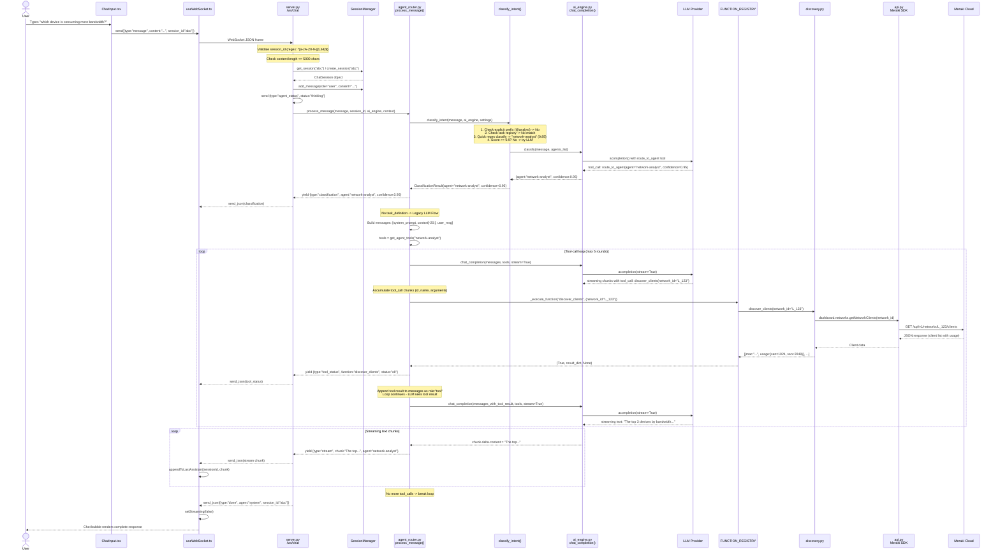
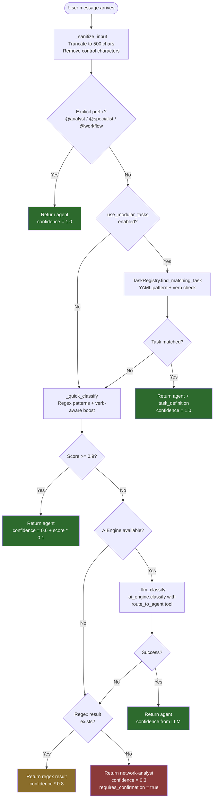
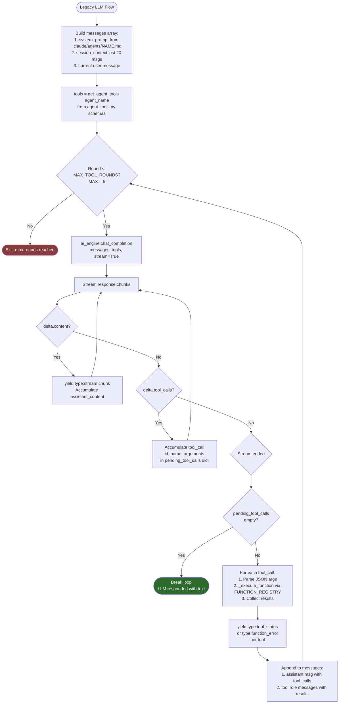
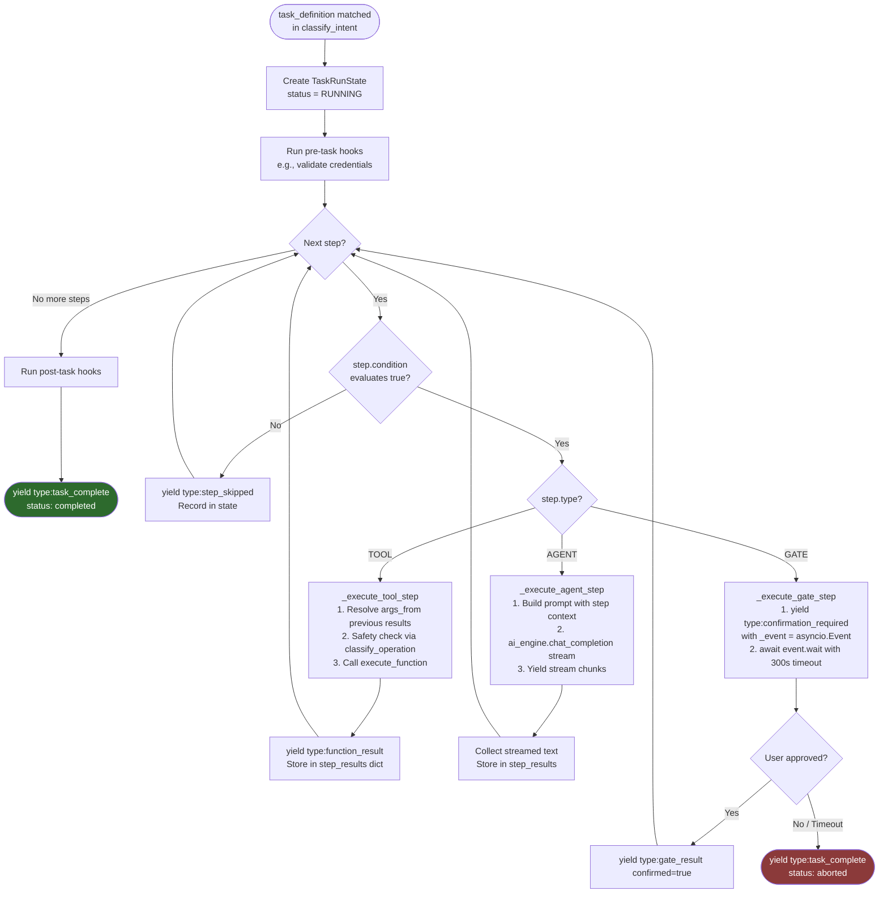
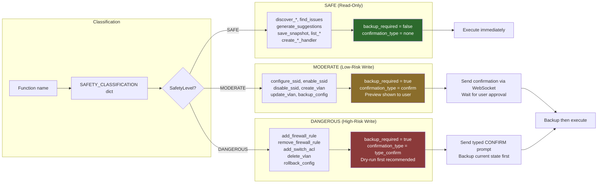
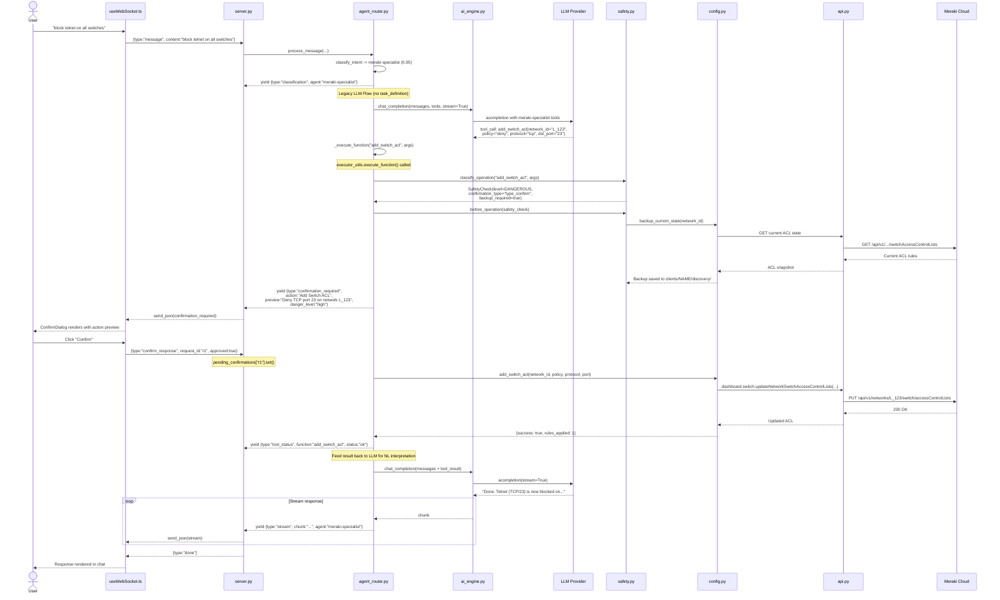

# CNL (Cisco Neural Language) - Flow Architecture

> **Version:** 1.0
> **Last Updated:** 2026-02-08
> **Tip:** Install a Mermaid preview extension in VS Code (e.g., "Markdown Preview Mermaid Support") to render the diagrams inline.

---

## 1. High-Level Architecture Overview

CNL is a conversational interface that translates natural language into Meraki Dashboard API operations. The system is composed of a React frontend, a FastAPI backend with WebSocket support, an LLM-powered agent router, and the Meraki cloud API.

```mermaid
graph TB
    subgraph Browser["Browser (React on :5173)"]
        UI[ChatView / ChatInput]
        WS_CLIENT[useWebSocket Hook]
        STORE[Zustand chatStore]
    end

    subgraph Backend["FastAPI Backend (:3141)"]
        SERVER[server.py<br/>WebSocket /ws/chat]
        ROUTER[agent_router.py<br/>classify_intent + process_message]
        TASK_EXEC[task_executor.py<br/>Deterministic Steps]
        SAFETY[safety.py<br/>SafetyLevel Check]
        REGISTRY[FUNCTION_REGISTRY<br/>40+ callables]
    end

    subgraph Modules["Python Modules"]
        DISCOVERY[discovery.py]
        CONFIG[config.py]
        WORKFLOW[workflow.py]
        REPORT[report.py]
    end

    subgraph External["External Services"]
        AI_ENGINE[ai_engine.py<br/>LiteLLM Wrapper]
        LLM[LLM Provider<br/>OpenAI / Anthropic / Google / Ollama]
        MERAKI[Meraki Dashboard API<br/>api.meraki.com/api/v1]
    end

    subgraph Storage["File System"]
        SNAPSHOTS[clients/NAME/discovery/]
        CONFIGS[clients/NAME/workflows/]
        REPORTS[clients/NAME/reports/]
        CREDS[~/.meraki/credentials]
    end

    UI -->|user types message| WS_CLIENT
    WS_CLIENT <-->|WebSocket JSON| SERVER
    WS_CLIENT -->|updates| STORE
    STORE -->|renders| UI

    SERVER -->|process_message()| ROUTER
    ROUTER -->|task_definition?| TASK_EXEC
    ROUTER -->|legacy LLM flow| AI_ENGINE
    TASK_EXEC -->|tool steps| REGISTRY
    TASK_EXEC -->|agent steps| AI_ENGINE
    TASK_EXEC -->|gate steps| SERVER

    AI_ENGINE <-->|acompletion()| LLM
    ROUTER -->|safety check| SAFETY

    REGISTRY --> DISCOVERY
    REGISTRY --> CONFIG
    REGISTRY --> WORKFLOW
    REGISTRY --> REPORT

    DISCOVERY -->|Meraki SDK| MERAKI
    CONFIG -->|Meraki SDK| MERAKI

    DISCOVERY -->|save_snapshot| SNAPSHOTS
    WORKFLOW -->|save_workflow| CONFIGS
    REPORT -->|generate_report| REPORTS
    CONFIG -->|backup_config| SNAPSHOTS
```

**Key design decisions:**

- **BYOK (Bring Your Own Key):** Users supply their own LLM API key via settings. LiteLLM abstracts the provider (`scripts/ai_engine.py`).
- **Dual execution paths:** Messages can flow through the legacy LLM tool-call loop or the deterministic Task Executor (Epic 7), controlled by the `use_modular_tasks` feature flag.
- **File-based storage:** No database. Snapshots, workflows, and reports are stored as JSON/HTML files under `clients/{name}/`.

---

## 2. Message Flow: User Question to Natural Language Answer

This diagram traces the full lifecycle of a read-only question like **"which device is consuming more bandwidth?"** through the legacy LLM path.



---

## 3. Agent Classification Flow

The `classify_intent()` function in `agent_router.py` uses a multi-tier pipeline to determine which agent should handle a message.



**Verb-aware scoring** (`verb_utils.py`): When `workflow-creator` has zero keyword matches, the router applies a +2.0 boost to `meraki-specialist` for action verbs (configure, create, add, block, delete) or to `network-analyst` for analysis nouns/verbs (discover, analyze, audit, investigate). This prevents ambiguous messages like "check the firewall" from misrouting.

---

## 4. Tool Execution Flow (Legacy LLM Path)

When no `task_definition` is matched, the router enters the legacy LLM flow in `process_message()`. This uses a conversation loop where the LLM can make tool calls, the system executes them, and feeds results back.



**Key details:**
- Tool call chunks arrive incrementally during streaming. The router accumulates `id`, `name`, and `arguments` across multiple chunks before execution.
- `_execute_function()` delegates to `executor_utils.execute_function()`, which runs sync functions via `asyncio.to_thread()`.
- After tool results are appended to the conversation, the loop repeats so the LLM can generate a natural language interpretation of the raw data.

---

## 5. Modular Task Executor Flow

The Task Executor (`task_executor.py`) provides a deterministic alternative to the LLM tool-call loop. Tasks are defined as YAML files in `tasks/` and matched by the `TaskRegistry` during classification.



**Gate confirmation protocol:** The executor yields a `confirmation_required` message containing a hidden `_event` (an `asyncio.Event`). The WebSocket handler in `server.py` intercepts this, stores the event in `pending_confirmations[request_id]`, and strips the internal `_event` field before sending to the client. When the client sends `{type: "confirm_response", request_id, approved}`, the handler calls `event.set()` to unblock the executor.

---

## 6. Safety Layer

The safety system (`safety.py`) classifies every function call into one of three risk levels and enforces appropriate guardrails.



**Unclassified functions** default to `DANGEROUS` -- this is a fail-safe that prevents new functions from bypassing safety checks.

Additional safety features in `safety.py`:
- **Rate limiter:** Limits write operations per time window to prevent accidental mass changes.
- **Dry-run mode:** Operations can be previewed without actually applying changes.
- **Undo/rollback:** `execute_undo()` can revert the last operation using backed-up state.

---

## 7. Configuration Write Flow

This diagram shows what happens when a user says **"block telnet on all switches"** -- a DANGEROUS operation that requires confirmation and backup.



---

## 8. Component Reference

### Frontend Files

| File | Purpose |
|------|---------|
| `frontend/src/hooks/useWebSocket.ts` | WebSocket connection, reconnect, message dispatch |
| `frontend/src/stores/chatStore.ts` | Zustand store: sessions, messages, streaming state |
| `frontend/src/stores/settingsStore.ts` | Zustand store: app settings, AI provider config |
| `frontend/src/stores/agentStore.ts` | Zustand store: agent list and selection |
| `frontend/src/components/chat/ChatView.tsx` | Main chat view with message list |
| `frontend/src/components/chat/ChatInput.tsx` | Text input with send button |
| `frontend/src/components/chat/MessageBubble.tsx` | Individual message rendering |
| `frontend/src/components/chat/StreamingText.tsx` | Animated streaming text display |
| `frontend/src/components/chat/DataRenderer.tsx` | Structured data (JSON/table) rendering |
| `frontend/src/components/chat/ConfirmDialog.tsx` | Safety confirmation dialog for MODERATE/DANGEROUS ops |
| `frontend/src/components/sidebar/Sidebar.tsx` | Session list + agent indicators |
| `frontend/src/components/onboarding/OnboardingWizard.tsx` | First-run setup wizard |
| `frontend/src/components/settings/SettingsPanel.tsx` | Settings modal with tabs |

### Backend Files

| File | Purpose |
|------|---------|
| `scripts/server.py` | FastAPI app, WebSocket `/ws/chat`, router mounts, CORS |
| `scripts/agent_router.py` | Intent classification, process_message, FUNCTION_REGISTRY |
| `scripts/ai_engine.py` | LiteLLM wrapper: chat_completion, classify, token tracking |
| `scripts/safety.py` | Safety classification, confirmation flows, backup, undo, rate limit |
| `scripts/task_executor.py` | Deterministic step executor (TOOL / AGENT / GATE steps) |
| `scripts/task_registry.py` | YAML task loader and pattern matcher |
| `scripts/task_models.py` | Pydantic/dataclass models for task definitions and run state |
| `scripts/verb_utils.py` | Verb/noun detection for classification boosting |
| `scripts/executor_utils.py` | Shared execute_function and serialize_result helpers |
| `scripts/agent_tools.py` | OpenAI-format tool schemas per agent |
| `scripts/discovery.py` | Network discovery functions (clients, devices, SSIDs, etc.) |
| `scripts/config.py` | Configuration write functions (SSID, VLAN, firewall, ACL) |
| `scripts/workflow.py` | Workflow JSON generation (offline handler, compliance, etc.) |
| `scripts/report.py` | HTML/PDF report generation |
| `scripts/api.py` | Meraki SDK wrapper with rate limiting |
| `scripts/auth.py` | Credential management from `~/.meraki/credentials` |
| `scripts/settings.py` | SettingsManager with encryption |
| `scripts/chat_session.py` | In-memory session/context management |
| `scripts/path_validation.py` | Path traversal protection for file operations |

### Key Data Flows

| Flow | Path |
|------|------|
| User message in | Browser -> WebSocket -> `server.py` -> `agent_router.process_message()` |
| Classification | `classify_intent()` -> prefix / task registry / regex / LLM |
| Read operation | `FUNCTION_REGISTRY` -> `discovery.py` -> `api.py` -> Meraki SDK -> Cloud |
| Write operation | `FUNCTION_REGISTRY` -> `safety.py` check -> `config.py` -> `api.py` -> Meraki SDK |
| LLM interaction | `agent_router.py` -> `ai_engine.chat_completion()` -> LiteLLM -> Provider API |
| Streaming response | `ai_engine.py` yields chunks -> `agent_router.py` yields -> `server.py` sends via WS |
| Task execution | `task_executor.py` steps -> TOOL/AGENT/GATE -> results streamed via WS |
| Confirmation gate | Server stores `asyncio.Event` -> Client sends `confirm_response` -> Event unblocked |

### WebSocket Protocol Summary

| Direction | Message Type | Purpose |
|-----------|-------------|---------|
| Client -> Server | `message` | User chat message with `content` and `session_id` |
| Client -> Server | `confirm_response` | User approval/denial with `request_id` and `approved` |
| Client -> Server | `cancel` | Cancel current operation |
| Client -> Server | `ping` | Keepalive (every 30s) |
| Server -> Client | `stream` | Text chunk with `chunk` and `agent` |
| Server -> Client | `data` | Structured data with `format` and `data` |
| Server -> Client | `classification` | Agent routing result with `agent` and `confidence` |
| Server -> Client | `agent_status` | Agent state: `thinking`, `executing`, `done` |
| Server -> Client | `tool_status` | Tool execution success notification |
| Server -> Client | `function_error` | Tool execution failure |
| Server -> Client | `confirmation_required` | Safety confirmation request with `preview` |
| Server -> Client | `task_start` / `step_start` | Task executor progress |
| Server -> Client | `error` | Error with `message` and `code` |
| Server -> Client | `done` | Message processing complete |
| Server -> Client | `pong` | Keepalive response |
