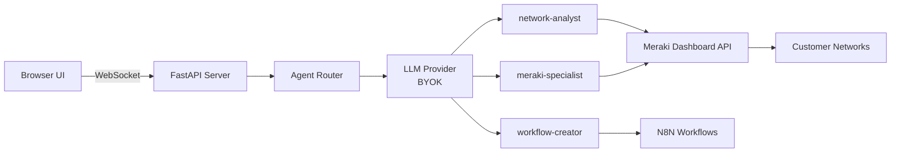

# CNL - Cisco Neural Language

**Manage Meraki networks by talking to them**

Internal Innovation Proposal

**Author:** jspetrucio
**Date:** February 2026

---

## The Problem

**Juniper Marvis is the #1 argument used against Meraki in competitive deals**

- Marvis offers conversational AI for network diagnostics
- Meraki has **NO equivalent** natural language capability
- ThousandEyes AI Assistant is monitoring-only — it doesn't configure anything

**The operational burden on network teams:**

- Network engineers spend **40-51% of their week** on manual, repetitive tasks (Skybox Security, 2024)
- **90% fear failing compliance audits** due to misconfigurations
- Manual configuration = human error = security vulnerabilities
- No natural language interface for the Meraki platform

**We're losing deals because we don't speak the language our customers want to use.**

---

## The Competitive Gap

| Capability | CNL | Juniper Marvis | ThousandEyes AI | Aruba Central | rConfig |
|-----------|-----|----------------|-----------------|---------------|---------|
| NL Troubleshooting | ✅ | ✅ | ✅ | ⚠️ Limited | ❌ |
| NL Configuration | ✅ | ❌ | ❌ | ❌ | ✅ |
| NL Discovery | ✅ | ✅ | ❌ | ⚠️ Limited | ❌ |
| NL Workflow Creation | ✅ | ❌ | ❌ | ❌ | ❌ |
| BYOK Multi-Provider AI | ✅ | ❌ | ❌ | ❌ | ❌ |
| Security Audit via NL | ✅ | ⚠️ Limited | ❌ | ❌ | ❌ |
| Compliance Check via NL | ✅ | ❌ | ❌ | ❌ | ✅ |
| Auto-Remediation | ✅ | ⚠️ Limited | ❌ | ❌ | ❌ |

**CNL wins on ALL categories. Marvis only covers troubleshooting.**

---

## The Solution - CNL

**Natural Language interface for the entire Meraki platform**

Real examples that work today:

- **"Block telnet on all switches"** → executes in 10 seconds (vs 15-30 min manual)
- **"Which device consumes the most bandwidth?"** → NL answer with real data
- **"Run a security audit on the NYC office"** → comprehensive report with actionable insights
- **"Create a workflow to alert me when a device goes offline"** → generates production-ready automation

**Architecture:**

- **3 specialized AI agents:** network-analyst, meraki-specialist, workflow-creator
- **Built-in safety layer:** confirmation prompts, dry-run mode, automatic backup/rollback
- **Multi-provider AI support:** OpenAI, Claude, Azure OpenAI, AWS Bedrock, Google Gemini
- **Zero vendor lock-in:** switch AI providers in one config line

---

## BYOK - Our Unfair Advantage

**Bring Your Own Key: customer uses their OWN AI provider**

### Why BYOK wins:

✅ **OpenAI, Claude, Azure OpenAI, AWS Bedrock, Google Gemini** — all supported
✅ **Zero vendor lock-in** — switch providers in 1 config line
✅ **Data sovereignty** — customer data NEVER leaves their infrastructure
✅ **40-90% cost savings** vs vendor-locked AI solutions
✅ **Compliance-ready** — GDPR, HIPAA, PCI-DSS, FedRAMP compatible
✅ **Customer choice** — use the model that works best for their use case

### The competitive moat:

**NO competitor offers BYOK for network management AI.**

- Juniper Marvis: locked to their backend
- ThousandEyes AI: locked to Cisco AI infrastructure
- Aruba Central: limited AI, no customer choice
- rConfig: no AI integration at all

**BYOK is our strategic differentiator.**

---

## Live Demo Preview

### Demo flow:

1. **User asks:** "Which devices are consuming the most bandwidth?"
2. **CNL classifies** → routes to network-analyst agent
3. **Calls Meraki API** → retrieves real-time traffic data
4. **LLM interprets** → "The top 3 devices are iPhone-Jose (1.7MB), MacBook-Pro (1.1MB), Cisco-AP (800KB)..."
5. **User asks:** "Block telnet on all switches"
6. **Safety layer** → asks for confirmation with preview of changes
7. **User confirms** → configuration applied with automatic backup created
8. **Result:** "Telnet blocked on 12 switches. Backup saved to: backup-2026-02-08-14-23.json"

**Time saved: 28 minutes → 15 seconds**

---

## Architecture

### Key components:

- **Frontend:** React 19 + TypeScript + shadcn/ui (web + Tauri desktop)
- **Backend:** Python 3.10+ FastAPI + WebSocket
- **AI Engine:** LiteLLM (multi-provider BYOK)
- **Agent Router:** LLM classification + regex fallback
- **Safety Layer:** Confirmation, dry-run, backup/rollback
- **Distribution:** pip, npm, Docker, Homebrew

**Simple, extensible, production-ready.**

---

## Current Status - Working Prototype

**Not a concept. A working system.**

### Test coverage:
- ✅ **646 tests passing** (comprehensive test suite)
- ✅ **30+ Meraki API methods** wrapped and tested
- ✅ **35 tool schemas** across 3 specialized agents
- ✅ **Full safety layer** (confirm, dry-run, backup/rollback)
- ✅ **Modular task executor** (deterministic + LLM paths)

### Technology stack:
- ✅ **Frontend:** React 19 + TypeScript + shadcn/ui + Zustand
- ✅ **Backend:** Python 3.10+ FastAPI + WebSocket
- ✅ **Desktop:** Tauri 2.0 (optional native app)
- ✅ **AI:** LiteLLM multi-provider (BYOK)

### Distribution ready:
- ✅ **pip** (Python package)
- ✅ **npm** (JavaScript package)
- ✅ **Docker** (containerized deployment)
- ✅ **Homebrew** (macOS native install)

---

## Roadmap

### Phase 1 (P0): Core Operations — 90 SP
- **+55 API methods** (15% platform coverage)
- Basic CRUD operations across all product lines
- Appliance, Camera, CellularGateway, Switch, Wireless, Sensor
- **Timeline:** 3 months

### Phase 2 (P1): Platform Depth — 75 SP
- **+65 API methods** (35% platform coverage)
- Advanced configurations, batch operations
- Organizations, Networks, Clients
- **Timeline:** 2 months

### Phase 3 (P2): Specialized Features — 50 SP
- **+50 API methods** (50% platform coverage)
- SM, Insight, Licensing, Administered
- **Timeline:** 2 months

### Phase 4: Smart Tools (Intelligence Layer) — 155 SP
- **12 smart tools** powered by AI
- Health scores, security audits, compliance checks
- Anomaly detection, predictive maintenance
- Auto-remediation workflows
- **Timeline:** 3 months

**Total: 370 Story Points over 10 months**

---

## Business Impact

### Market size:
- **$5.7-7.9B** network automation market
- **18-22% CAGR** through 2028
- **Growing demand** for AI-powered infrastructure

### Customer ROI:
- **350-600% ROI** for enterprises
- **Payback in 2-3 months**
- **$725K-$1.3M/year savings** per 5-engineer team

### Operational impact:
- **95-99% time reduction** for common tasks
- **Error elimination:** from 5-10/month to ~0
- **Faster time-to-resolution:** hours → minutes
- **Improved compliance posture**

### Competitive positioning:
- **First-mover advantage** in NL network management
- **BYOK differentiator** — no competitor offers this
- **Defense against Juniper Marvis** in competitive deals

---

## Revenue Opportunity

### Direct revenue:
- **Pro tier:** $49/month × 75,000 MSP customers × 20% adoption = **$88M/year**
- **Enterprise tier:** $199/month × 9,000 enterprise customers × 60% adoption = **$129M/year**
- **Total direct:** **$87M-$216M/year**

### Indirect impact:
- **Churn reduction:** $125M-$235M/year (2-3% improvement in retention)
- **Upsell acceleration:** 15-25% increase in upgrade rate
- **New customer acquisition:** CNL as competitive differentiator

### Total business impact:
- **Combined impact:** **$212M-$451M/year**
- **Year 1 investment:** $1.0-$1.6M
- **ROI for Cisco:** **3,400-7,500%**
- **Payback period:** **< 1 month**

---

## The Ask

### Resources needed:
- **3 engineers** for 6 months to complete Phase 1
- **Backend specialist** (Python/FastAPI/LLM integration)
- **Frontend specialist** (React/TypeScript/UI/UX)
- **DevOps/Test engineer** (CI/CD, distribution, testing)

### Execution plan:
- **Pilot with 5-10 selected MSP partners**
- **Executive sponsor alignment** with Meraki Product leadership
- **Internal beta in 90 days**
- **Public beta in 6 months**

### Investment:
- **Phase 1 budget:** ~$500K (3 engineers × 6 months)
- **Infrastructure:** Minimal (leverages existing Meraki API)
- **Marketing/GTM:** Partner with existing Meraki PMM

---

## Why Now?

### Competitive urgency:
- ✅ **Juniper Marvis is winning deals TODAY**
- ✅ **rConfig startup** already doing NL + network configuration
- ✅ **First-mover window is closing**

### Market momentum:
- ✅ **Gartner:** network automation triples by 2026
- ✅ **Customer demand:** "Why can't I just talk to my network?"
- ✅ **AI hype cycle:** enterprises allocating budget NOW

### Strategic alignment:
- ✅ **Cisco AI strategy:** AI-first infrastructure vision
- ✅ **Meraki platform maturity:** API coverage is excellent
- ✅ **BYOK positioning:** customer data sovereignty is a key differentiator

### Technical readiness:
- ✅ **Working prototype exists** — not starting from zero
- ✅ **646 tests passing** — production-quality codebase
- ✅ **Distribution channels ready** — pip, npm, Docker, Homebrew

**The technology is ready. The market is ready. The competition is moving. We need to act now.**

---

## Contact / Next Steps

**Jose Petrucio da Silva**
**Email:** jspetrucio
**Project:** CNL - Cisco Neural Language
**GitHub:** [Internal Cisco Repository]

### Available immediately:
- ✅ **Live demo** on request
- ✅ **Technical deep-dive** with engineering teams
- ✅ **Pilot partner discussion**
- ✅ **Roadmap review session**

### Next steps:
1. **Schedule 30-min demo** with Meraki Product leadership
2. **Identify executive sponsor** (VP/CTO level)
3. **Select pilot partners** (5-10 MSPs)
4. **Allocate engineering resources** (3 engineers, 6 months)
5. **Define success metrics** for beta program

---

# "Let me show you what Meraki sounds like."
