# Squad Creator - Architecture Diagrams

> **Documento avançado/técnico.** Não é necessário para usar o Squad Creator.
>
> **Primeira vez?** Comece por [POR-ONDE-COMECAR.md](./POR-ONDE-COMECAR.md).
>
> Diagramas de sequência dos principais fluxos. Renderize com [Mermaid Live](https://mermaid.live).

---

## 1. Fluxo Principal: Criação de Squad

---

## 2. Fluxo: Clone Mind (DNA Extraction)

```mermaid
sequenceDiagram
    autonumber
    participant U as User
    participant CM as Clone Mind
    participant CS as Collect Sources
    participant AA as Auto-Acquire
    participant VE as Voice Extractor
    participant TE as Thinking Extractor
    participant ST as Smoke Tests

    U->>CM: *clone-mind {name} --domain {domain}

    rect rgb(50, 40, 40)
        Note over CM,CS: PHASE 0: SOURCE COLLECTION
        CM->>CS: Iniciar coleta de fontes

        alt User forneceu materiais
            CS->>CS: Indexar como Tier 0
        else Sem materiais
            CS->>AA: Executar auto-acquire
            AA->>AA: YouTube transcripts
            AA->>AA: Book summaries
            AA->>AA: Podcasts
            AA-->>CS: Fontes encontradas
        end

        alt < 10 fontes
            CS->>CS: Manual web search
        end

        alt < 5 fontes
            CS-->>U: ❌ Expert muito obscuro
            Note over U: Workflow PARA
        else >= 5 fontes
            CS-->>CM: sources_inventory.yaml
        end
    end

    rect rgb(40, 50, 40)
        Note over CM,VE: PHASE 1: VOICE DNA
        CM->>VE: Extrair Voice DNA
        VE->>VE: Power words
        VE->>VE: Signature phrases
        VE->>VE: Stories/anecdotes
        VE->>VE: Anti-patterns
        VE->>VE: Immune system
        VE-->>CM: voice_dna.yaml (8/10 min)
    end

    rect rgb(40, 40, 50)
        Note over CM,TE: PHASE 2: THINKING DNA
        CM->>TE: Extrair Thinking DNA
        TE->>TE: Recognition patterns
        TE->>TE: Frameworks
        TE->>TE: Heuristics
        TE->>TE: Objection handling
        TE->>TE: Handoff triggers
        TE-->>CM: thinking_dna.yaml (7/9 min)
    end

    CM->>CM: Synthesis: Combinar DNAs
    CM->>CM: Gerar mind_dna_complete.yaml

    rect rgb(60, 40, 60)
        Note over CM,ST: PHASE 4: SMOKE TESTS
        CM->>ST: Executar 3 testes
        ST->>ST: Test 1: Domain Knowledge
        ST->>ST: Test 2: Decision Making
        ST->>ST: Test 3: Objection Handling

        alt 3/3 PASS
            ST-->>CM: ✅ Agente validado
        else Qualquer FAIL
            ST-->>CM: ❌ Re-trabalhar DNA
            CM->>VE: Revisar seção que falhou
        end
    end

    CM->>CM: Gerar Quality Dashboard
    CM-->>U: mind_dna_complete.yaml + dashboard
```

---

## 3. Fluxo: Coleta de Fontes (Fallback Chain)

```mermaid
sequenceDiagram
    autonumber
    participant CS as Collect Sources
    participant T0 as Tier 0 (User)
    participant AA as Auto-Acquire
    participant WS as Web Search
    participant VAL as Validation

    CS->>CS: Verificar user_materials_path

    alt Usuário forneceu materiais
        CS->>T0: Indexar materiais
        T0-->>CS: Tier 0 sources
        Note over CS: Continua para complementar
    end

    CS->>AA: Executar auto-acquire

    par Busca paralela
        AA->>AA: YouTube: "{name}" interview
        AA->>AA: Books: "{name}" books summary
        AA->>AA: Podcasts: "{name}" podcast guest
        AA->>AA: Articles: "{name}" blog newsletter
    end

    AA-->>CS: acquired_sources.yaml

    CS->>CS: Contar fontes totais

    alt total >= 10
        CS->>VAL: Prosseguir para validação
    else total < 10
        CS->>WS: Executar queries manuais
        WS->>WS: "{name}" books
        WS->>WS: "{name}" interview transcript
        WS->>WS: "{name}" framework methodology
        WS-->>CS: Fontes adicionais
    end

    CS->>CS: Recontar fontes

    alt total >= 5
        CS->>VAL: Validar cobertura
        VAL->>VAL: Check: 10+ fontes?
        VAL->>VAL: Check: 5+ Tier 1?
        VAL->>VAL: Check: 3+ tipos?
        VAL->>VAL: Check: Triangulação?

        alt 4/5 blocking PASS
            VAL-->>CS: GO ou CONDITIONAL
        else < 4/5 blocking
            VAL-->>CS: NO-GO
        end
    else total < 5
        CS-->>CS: ❌ FAIL - Expert muito obscuro
        Note over CS: Sugerir: fornecer materiais<br/>ou escolher outro expert
    end

    CS-->>CS: sources_inventory.yaml
```

---

## 4. Fluxo: Smoke Tests

---

## 5. Fluxo: YOLO vs QUALITY Mode

```mermaid
sequenceDiagram
    autonumber
    participant U as User
    participant SA as Squad Architect
    participant CP as Checkpoints

    U->>SA: *create-squad {domain}
    SA->>U: PRE-FLIGHT: Escolha modo

    alt YOLO Mode
        U-->>SA: 🚀 YOLO (sem materiais)
        Note over SA: Fidelity esperada: 60-75%

        SA->>SA: Research (auto)
        SA->>SA: Clone minds (auto)
        SA->>SA: Create agents (auto)

        loop Para cada checkpoint
            SA->>CP: Verificar critérios
            alt Critérios OK
                CP-->>SA: Auto-proceed ✅
            else Falha crítica
                CP-->>SA: STOP ❌
                SA->>U: Pedir input
            end
        end

        SA->>CP: CP_FINAL
        CP->>U: Aprovação final obrigatória

    else QUALITY Mode
        U-->>SA: 💎 QUALITY (com materiais)
        Note over SA: Fidelity esperada: 85-95%

        SA->>SA: Research
        SA->>CP: CP1: Validar minds
        CP->>U: Aprovar minds?
        U-->>CP: Aprovado

        SA->>U: Solicitar materiais
        U-->>SA: Fornecer paths

        SA->>SA: Clone minds
        SA->>CP: CP_DNA: Validar DNA
        CP->>U: DNA está correto?
        U-->>CP: Aprovado

        SA->>SA: Create agents
        SA->>CP: CP_AGENT: Smoke tests
        CP->>U: Apresentar resultados

        SA->>CP: CP_FINAL
        CP->>U: Aprovação final

    else HYBRID Mode
        U-->>SA: 🔀 HYBRID (alguns materiais)
        Note over SA: Fidelity: variável por expert

        loop Para cada mind
            SA->>U: Tem materiais de {mind}?
            alt Sim
                U-->>SA: Path dos materiais
                Note over SA: Quality mode para este
            else Não
                Note over SA: YOLO mode para este
            end
        end
    end

    SA->>U: Squad criado + Quality Dashboard
```

---

## 6. Estrutura de Arquivos do Squad-Creator

---

## 7. Quality Gates Flow

```mermaid
flowchart TD
    START([Início]) --> PF[Pre-Flight]

    PF --> |Mode selecionado| P0[Phase 0: Discovery]
    P0 --> QG0{SOURCE_QUALITY<br/>5/5 blocking?}

    QG0 --> |PASS| P1[Phase 1: Voice DNA]
    QG0 --> |FAIL| STOP1[❌ Buscar mais fontes]
    STOP1 --> P0

    P1 --> QG1{VOICE_QUALITY<br/>8/10 min?}
    QG1 --> |PASS| P2[Phase 2: Thinking DNA]
    QG1 --> |WARN| P2

    P2 --> QG2{THINKING_QUALITY<br/>7/9 min?}
    QG2 --> |PASS| P3[Phase 3: Synthesis]
    QG2 --> |WARN| P3

    P3 --> QG3{SYNTHESIS_QUALITY<br/>Consistente?}
    QG3 --> |PASS| P4[Phase 4: Smoke Tests]
    QG3 --> |FAIL| STOP3[❌ Revisar DNA]
    STOP3 --> P1

    P4 --> QG4{SMOKE_TEST<br/>3/3 pass?}
    QG4 --> |PASS| P5[Phase 5: Dashboard]
    QG4 --> |FAIL| STOP4[❌ Re-trabalhar agent]
    STOP4 --> P3

    P5 --> FINAL{CP_FINAL<br/>User approval}
    FINAL --> |Approve| DONE([✅ Squad Pronto])
    FINAL --> |Reject| ADJUST[Ajustar]
    ADJUST --> P4
```

---

## Como Visualizar

1. **Mermaid Live Editor:** https://mermaid.live
2. **VS Code:** Instalar extensão "Markdown Preview Mermaid Support"
3. **GitHub:** Renderiza automaticamente em arquivos .md
4. **Obsidian:** Suporte nativo a Mermaid

---

**Squad Architect | Architecture Diagrams v1.0**
*"A picture is worth a thousand lines of YAML."*
